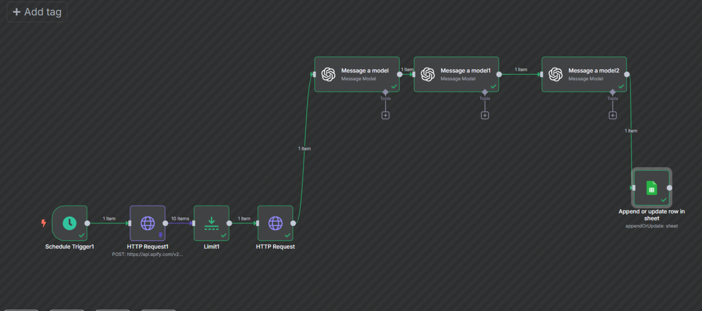
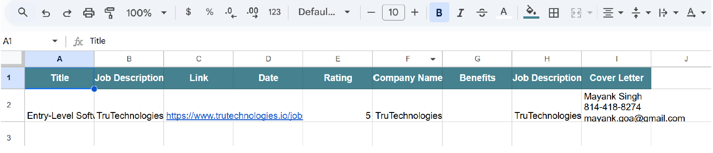

# 🚀 Automated Job Application System

An AI-powered workflow that automates the job application process — from scraping job listings to generating personalized cover letters.

Built using **n8n, Apify, and GPT-4.0-mini**, this system reduces manual job search effort by over 80%.

---

## 📌 Motivation

Job hunting is repetitive and time-consuming:
- Reading job descriptions
- Evaluating relevance
- Writing tailored cover letters

This project automates the entire pipeline using AI and workflow orchestration.

---

## ⚙️ System Overview

The system runs daily and performs:

1. Scrapes job listings from Indeed  
2. Extracts structured job data  
3. Evaluates job relevance using AI  
4. Generates personalized cover letters  
5. Stores results in Google Sheets  

---

## 🧠 Tech Stack

- **n8n** → Workflow automation  
- **Apify** → Web scraping (Indeed jobs)  
- **GPT-4.0-mini** →  
  - Data extraction  
  - Job relevance scoring  
  - Cover letter generation  
- **Google Sheets API** → Data storage  

---

## 🔄 Workflow Architecture

### Step 1 — Trigger
- Runs automatically every day at noon  

### Step 2 — Job Scraping
- Scrapes jobs from Indeed using filters (role, location, etc.) 
- Extracts:
  - Title  
  - Company  
  - Description  
  - Salary (if available)  

---

### Step 3 — Data Processing (GPT Model 1)
- Converts raw scraped JSON into structured data  
- Extracts key fields:
  - Company name  
  - Job description  
  - Benefits  
  - Location 

---

### Step 4 — Job Relevance Scoring (GPT Model 2)
- Compares job with candidate resume  
- Outputs a score (0–5) based on:
  - Skill match  
  - Experience level  
  - Role relevance 

---

### Step 5 — Cover Letter Generation (GPT Model 3)
- Generates a **custom cover letter for each job**  
- Uses:
  - Job description  
  - Candidate resume 
---

### Step 6 — Data Storage
- Stores results in Google Sheets:
  - Job title  
  - Company  
  - Description  
  - Link  
  - AI score  
  - Generated cover letter 

---

## 📊 Output

- Daily updated job list  
- AI-rated job relevance  
- Unique cover letter per job  
- Duplicate jobs automatically filtered  

---

## 📸 Screenshots

### 🔁 Workflow

### ⚙️ n8n Pipeline


### 📊 Output (Google Sheets)



---

## 🧩 Key Features

✔ Fully automated pipeline  
✔ AI-based job filtering  
✔ Personalized cover letter generation  
✔ Daily scheduled execution  
✔ Cost-efficient scraping (controlled API usage) 

---

## 🚀 Impact

- Saves hours of manual job search  
- Improves application quality  
- Enables scalable job applications  

---

## 📁 Repository Structure

```bash
automated-job-application-system/
│── README.md
│── docs/
│   └── n8n_indeed
│
